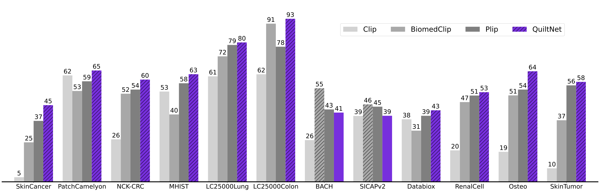

---
tags:
- zero-shot-image-classification
- clip
- vision
- language
- histopathology
- histology
- medical
library_tag: open_clip
license: mit
widget:
  - src: >-
      https://quilt1m.github.io/img/BREST092.jpg
    candidate_labels: adipose tissue, debris tissue, lymphocytes tissue, mucus tissue, smooth muscle tissue, normal colon mucosa tissue, cancer-associated stroma tissue, colorectal adenocarcinoma epithelium tissue
    example_title: Tissue phenotyping
  - src: >-
      https://huggingface.co/microsoft/BiomedCLIP-PubMedBERT_256-vit_base_patch16_224/resolve/main/example_data/biomed_image_classification_example_data/squamous_cell_carcinoma_histopathology.jpeg
    candidate_labels: adenocarcinoma histopathology, squamous cell carcinoma histopathology
    example_title: squamous cell carcinoma histopathology
  - src: >-
      https://huggingface.co/microsoft/BiomedCLIP-PubMedBERT_256-vit_base_patch16_224/resolve/main/example_data/biomed_image_classification_example_data/adenocarcinoma_histopathology.jpg
    candidate_labels: adenocarcinoma histopathology, squamous cell carcinoma histopathology
    example_title: adenocarcinoma histopathology
pipeline_tag: zero-shot-image-classification
---


## QuiltNet-B-32 Description

[QuiltNet-B-32](https://github.com/wisdomikezogwo/quilt1m/) is a CLIP ViT-B/32 vision-language foundation model trained on the [Quilt-1M](https://quilt1m.github.io/) dataset curated from representative histopathology videos.
It can perform various vision-language processing (VLP) tasks such as cross-modal retrieval, image classification, and visual question answering. 
QuiltNet establishes new state of the art in a wide range of standard datasets, and substantially outperforms prior VLP approaches:




# Citation
```bibtex
@misc{ikezogwo2023quilt1m,
      title={Quilt-1M: One Million Image-Text Pairs for Histopathology}, 
      author={Wisdom Oluchi Ikezogwo and Mehmet Saygin Seyfioglu and Fatemeh Ghezloo and Dylan Stefan Chan Geva and Fatwir Sheikh Mohammed and Pavan Kumar Anand and Ranjay Krishna and Linda Shapiro},
      year={2023},
      eprint={2306.11207},
      archivePrefix={arXiv},
      primaryClass={cs.CV}
}
```


# Uses

As per the original [OpenAI CLIP model card](https://github.com/openai/CLIP/blob/d50d76daa670286dd6cacf3bcd80b5e4823fc8e1/model-card.md), this model is intended as a research output for research communities. We hope that this model will enable researchers to better understand and explore zero-shot, arbitrary image classification. We also hope it can be used for interdisciplinary studies of the potential impact of such model. 

The OpenAI CLIP paper includes a discussion of potential downstream impacts to provide an example for this sort of analysis.

## Direct Use

Zero-shot image classification, image and text retrieval, among others.

## Downstream Use

Image classification and other image task fine-tuning, linear probe image classification, image generation guiding and conditioning, among others.

### Intended Use

The model is intended as a research output for research communities. We hope that this model will enable researchers to better understand and explore zero-shot, arbitrary image classification. We also hope it can be used for interdisciplinary studies of the potential impact of such models.

#### Primary intended uses

The primary intended users of these models are AI researchers.

We primarily imagine the model will be used by researchers to better understand robustness, generalization, and other capabilities, biases, and constraints of computer vision histopathology models.

### Out-of-Scope Use Cases

**Any** deployed use case of the model - whether commercial or not - is currently out of scope. Non-deployed use cases such as image search in a constrained environment, are also not recommended unless there is thorough in-domain testing of the model with a specific, fixed class taxonomy.

Since the model has not been purposefully trained in or evaluated on any languages other than English, its use should be limited to English language use cases.

Further the above notice, the Quilt-1M dataset used in training of these models has additional considerations, see below.

## Training Data

This model was trained with [QUILT-1M](https://quilt1m.github.io/) is an image-text dataset for histopathology.
Curated from educational videos on Youtube QUILT-1M contributes the largest dataset for vision language modeling in histopathology.

**IMPORTANT NOTE:** The motivation behind dataset creation is to democratize research and experimentation around large-scale multi-modal model training and handling of uncurated, large-scale histopathology datasets crawled from publically available internet. Our recommendation is therefore to use the dataset for research purposes.

# Evaluation

Evaluation done with code in the [CLIP Benchmark suite](https://github.com/LAION-AI/CLIP_benchmark) and results can be found in the paper on a list of varying histology tasks and datasets.


# Disclaimer
It is important to note that the results obtained from this function are not intended to constitute medical advice or replace consultation with a qualified medical professional. The use of this function is solely at your own risk and should be consistent with applicable laws, regulations, and ethical considerations. We do not warrant or guarantee the accuracy, completeness, suitability, or usefulness of this function for any particular purpose, and we hereby disclaim any liability arising from any reliance placed on this function or any results obtained from its use.

# Privacy
In accordance with the privacy policy of Youtube, only Video IDs data is redistributed by us.
It is strictly prohibited to redistribute any content apart from the Video IDs.
Any distribution carried out must adhere to the laws and regulations applicable in your jurisdiction, including export control laws and embargoes.'
